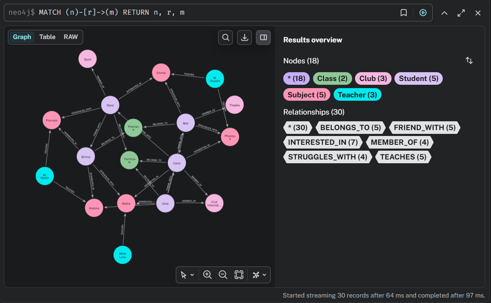
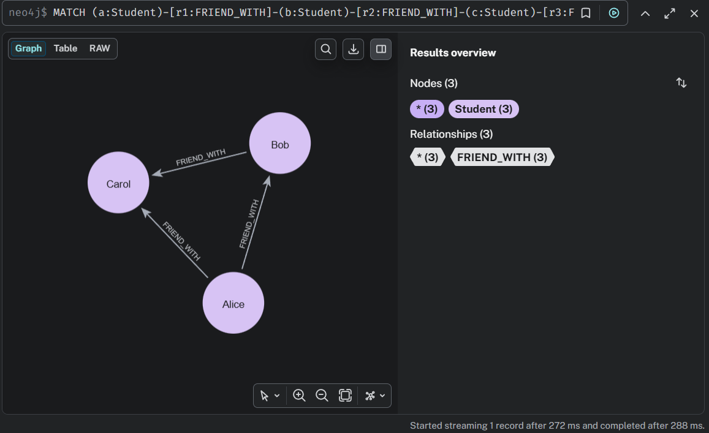
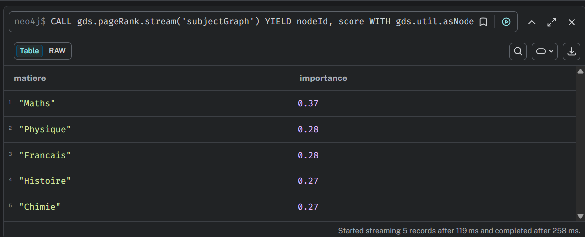
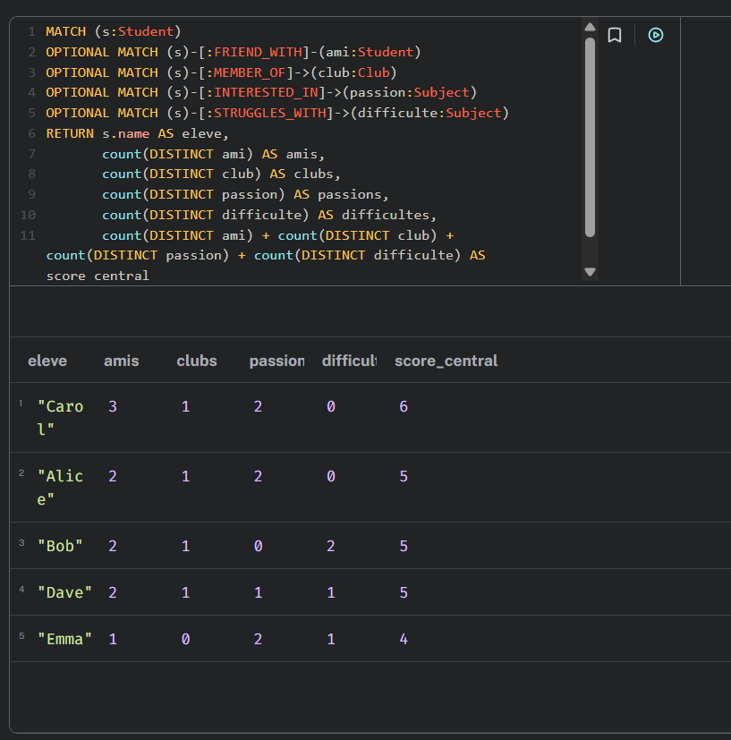
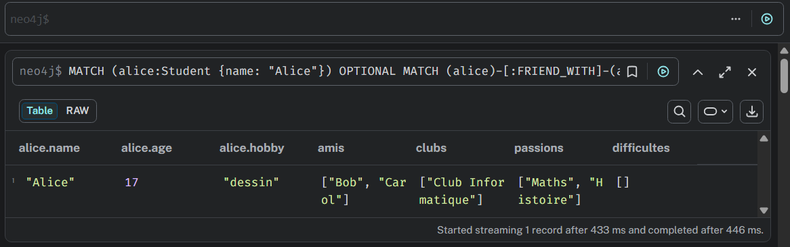

# 🕸️ Agent GraphRAG sur Neo4j

> Projet de Master Data & IA, Nexa Digital School.
> Relier un LLM à un graphe de connaissances pour qu'il réponde **en suivant les relations entre les données**, et pas seulement en cherchant des textes similaires.



## L'idée : GraphRAG

Le **RAG** classique permet à un LLM de chercher des documents proches de la question avant de répondre. Le **GraphRAG** va plus loin : il s'appuie sur un **graphe de connaissances** et **traverse les relations** pour construire un raisonnement.

> **Question** : « Bob a du mal en Physique. Qui peut l'aider ? »
> **Raisonnement** : Bob a du mal en Physique → Carol est son amie → Carol est passionnée de Physique
> **Réponse** : « Carol peut aider Bob, car ils sont amis et elle aime la Physique. »

## Ce que j'ai réalisé

- **Modélisation d'un graphe scolaire dans Neo4j** : 18 nœuds (élèves, professeurs, matières, classes, clubs) et 30 relations de 6 types (amitiés, centres d'intérêt, difficultés, enseignements…).
- **Un script de création réexécutable**, écrit avec `MERGE` : on peut le relancer sans créer de doublons.
- **Le system prompt d'un agent IA** qui traduit les questions en requêtes Cypher, avec le schéma du graphe, un raisonnement étape par étape et un **garde-fou de sécurité** : lecture seule, aucune modification des données.
- **Des analyses de complexité croissante** : profil d'un élève, recherche d'un tuteur en 3 étapes, centralité, détection de cliques, plus court chemin.
- **Une analyse avancée avec Graph Data Science** : projection du graphe et PageRank des matières.

## Résultats

| Analyse | Résultat |
|---|---|
| Recherche de tuteur pour Bob en Physique | **Carol**, son amie, passionnée par la matière |
| Élève le plus central du réseau | **Carol**, score de 6 (3 amis, 1 club, 2 passions) |
| Matière la plus importante (PageRank) | **Maths**, 0,37 |
| Groupe d'amis mutuels (clique) | **Alice, Bob et Carol** |

| Clique détectée | PageRank des matières |
|---|---|
|  |  |

| Score de centralité des élèves | Profil social d'Alice |
|---|---|
|  |  |

## Pourquoi un graphe plutôt que du SQL ?

Trouver un groupe de 3 amis tous liés entre eux demande **6 jointures** en SQL. En Cypher, c'est un seul motif :

```cypher
MATCH (a:Student)-[:FRIEND_WITH]-(b:Student)-[:FRIEND_WITH]-(c:Student)-[:FRIEND_WITH]-(a)
WHERE a.name < b.name AND b.name < c.name
RETURN a.name, b.name, c.name
```

## Structure du dépôt

```
├── cypher/
│   ├── 01_creation_graphe.cypher       # création du graphe (MERGE, sans doublons)
│   ├── 02_verification.cypher          # contrôle : 18 nœuds, 30 relations
│   ├── 03_requetes_analyse.cypher      # profil, tuteur, centralité, cliques, plus court chemin
│   └── 04_graph_data_science.cypher    # projection et PageRank (plugin GDS)
├── prompt/
│   └── system_prompt_graph_scolaire.md # prompt de l'agent, annoté
└── captures/                           # résultats dans Neo4j
```

## Lancer le projet

1. Installer **Neo4j Desktop** et créer une instance locale, avec le plugin **Graph Data Science** pour la partie PageRank.
2. Ouvrir l'onglet **Query** et exécuter `cypher/01_creation_graphe.cypher`.
3. Vérifier avec `cypher/02_verification.cypher` : vous devez obtenir 18 nœuds et 30 relations.
4. Lancer les requêtes de `cypher/03_requetes_analyse.cypher`, puis `cypher/04_graph_data_science.cypher`.
5. Pour tester l'agent : copier le prompt de `prompt/` dans les instructions système d'un LLM, puis lui poser des questions en langage naturel.

## Ce que j'ai appris

- Le **schéma dans le prompt** est l'élément décisif : sans lui, le LLM invente des relations qui n'existent pas.
- **`MERGE` plutôt que `CREATE`** : en relançant un script `CREATE` trois fois, ma base est passée de 18 à 54 nœuds et 1 472 relations en double. Le script `MERGE` règle ce problème.
- Les graphes rendent **simples** des questions qui sont **complexes** en SQL : chemins, cliques, centralité.

## Stack

Neo4j · Cypher · Neo4j Graph Data Science (PageRank) · Prompt engineering · GraphRAG

---

👩‍💻 **Nosaiba Elkrekshi** · 

Master 2 Data & IA · 

[LinkedIn](https://www.linkedin.com/in/nosaiba-elkrekshi) · 

nosaiba.elkrekshi@gmail.com
